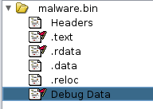

# $tealer

Your enterprise network is experiencing a malware infection, and your SOC L1 colleague escalated the case for you to investigate. As an experienced L2/L3 SOC analyst, analyze the malware sample, figure out what it does and extract C2 server and other important IOCs.

P.S.: Make sure to analyze files in an isolated/virtualized environment as some artifacts may be malicious.
Compression password: `cyberdefenders.org_NeE6qBxcIo68R3Wj6DWw`

## Infos

| Start Date | End Date | CTF Type | CTF Authors |
| ---------- | ---------- | ---------- | ---------- |
| Nov. 20, 2021 | Nov. 21, 2021 | Public | Nidal Fikri |

## Files
[stealer.zip](https://download.cyberdefenders.org/misc/stealer.zip)   79b22089b56dbb6b6f422124393fa4ed55ab4f5e

## Questions
For the most things we are using some webtools or ghidra.

### Q#1 The provided sample is fully unpacked. How many sections does the sample contain?
If you load the `malware.bin` into ghidra, you will see four sections. So that should be the flag.

> 4

### Q#2 How many imported windows APIs are being used by the sample?
Also in Ghidra we can see the kernel dll file and the dll registerserver.

> 2

### Q#3 The sample is resolving the needed win APIs at run-time using API hashing. Looking at the DllEntryPoint, which function is responsible for resolving the wanted APIs?

### Q#4 Looking inside the function being described in question 3, which function is responsible for locating & retrieving the targetted module (DLL)?

### Q#5 What type of hashing is being used for the API hashing technique?

### Q#6 What is the address of the function which performs the hashing?

### Q#7 What key is being used for XORing the hashed names?

### Q#8 What information is being accessed at the address 0X60769A?

### Q#9 Looking inside the function being described in question 3, which function is responsible for locating & retrieving the targetted API 
from the module export table?

### Q#10 Diving inside the function being described in question 9, what is being accessed at offset 0X3C within the first passed parameter?

### Q#11 Which windows API is being resolved at the address 0X5F9E47 ?

### Q#12 Looking inside sub_607980, which DLL is being resolved?

### Q#13 Also Looking inside sub_607980, which API is being resolved?

### Q#14 What is the appropriate data type of the only argument at function sub_607D40?

### Q#15 After reverse-engineering sub_607980 and knowing its purpose, Which assembly instruction is being abused for further anti-analysis complication, especially when running the sample? (one space included)

### Q#16 After reverse-engineering sub_607980 and knowing its purpose, Which assembly instruction is being used for altering the process execution flow? (Also adds anti-disassembly complication)

### Q#17 There are important encrypted strings in the .data section. Which encryption algorithm is being used for decryption?

### Q#18 What is the address of the function that is responsible for strings decryption?

### Q#19 What are the two first decrypted words (space separated strings) at 0X629BE8?

### Q#20 What is the key used for decrypting the strings in question 19?

### Q#21 What is the length (in bytes) of the used key in question 19?

### Q#22 What is the address of the function that is responsible for connecting to the C&C?

### Q#23 What is the first C&C IP address in the embedded configuration?

### Q#24 What is the port associated with the first C&C IP address?

### Q#25 How many C&C IP addresses are in the sample configuration?

### Q#26 What is the address of the function which may download additional modules to extend the malware functionality?

